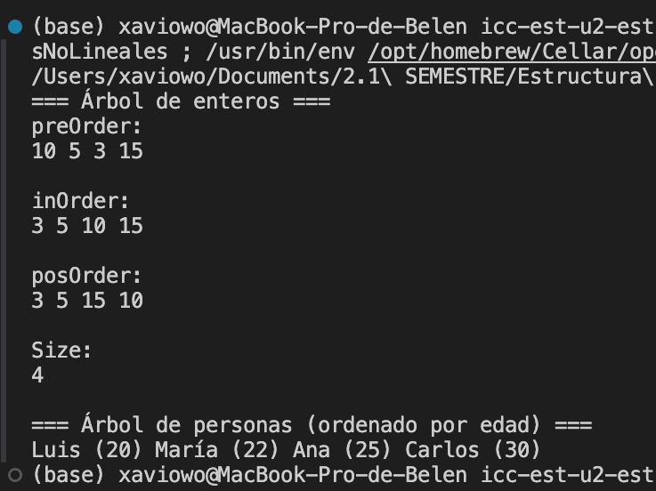
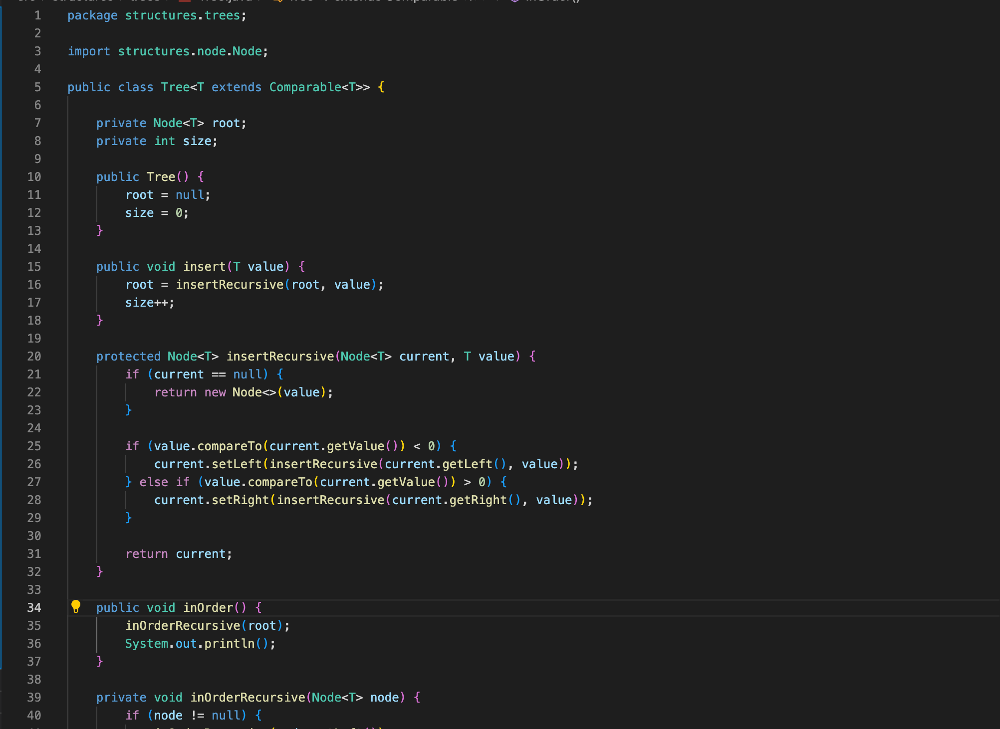

# Práctica: Estructuras No Lineales -

## Autor
- Nombre: Erika Collaguazo
- Carrera/Curso: Estructura de Datos

## Nombre de la práctica - Fecha
- Práctica: Práctica de Árboles – Implementación Integers
- Fecha: 2026-09-05

## Descripción
En esta práctica se implementó un Árbol Binario de Búsqueda para enteros (IntTree).
El árbol permite la inserción de valores y la impresión de los recorridos
PreOrder, InOrder y PostOrder.  
Además, se implementó un método `size()` con complejidad O(1), utilizando un
contador interno que se actualiza cada vez que se inserta un nodo en el árbol.

## Evidencias

### Captura 1
Salida de consola donde se muestran los recorridos PreOrder, InOrder,
PostOrder y el tamaño total del árbol.

### Captura 2
Código fuente donde se observa el atributo contador `size` y el método
`size()` retornando directamente su valor, garantizando complejidad O(1).

---

## Práctica de Árboles – Implementación Genéricos uso de interfaces Comparable

### Descripción
En esta práctica se implementó un Árbol Binario de Búsqueda genérico utilizando las clases `Node<T>` y `Tree<T>`.  
El árbol permite insertar y buscar elementos de cualquier tipo siempre que implementen la interfaz `Comparable`.

El criterio de ordenamiento no está definido en la clase `Tree`, sino que se establece en las clases de los objetos almacenados.  
Para este caso, se implementó la clase `Persona`, donde el criterio de comparación se basa en el atributo `edad`.

Se implementó el recorrido **InOrder**, el cual permite visualizar los elementos del árbol ordenados de forma ascendente.

---
## Evidencias

### Captura 1 - Captura del método de búsqueda genérico implementado en la clase Tree<T>.
El método de búsqueda compara el valor buscado con el valor almacenado en el nodo actual usando compareTo.
Si los valores coinciden, se retorna el elemento.
Si el valor buscado es menor, la búsqueda continúa por el subárbol izquierdo; si es mayor, continúa por el subárbol derecho.
Este proceso se realiza de forma recursiva hasta encontrar el elemento o llegar a un nodo nulo.
 8.58.03 a. m..png>)
 8.58.03 a. m..png>)
 8.59.43 a. m..png>)
### Captura 2 - Salida de consola
